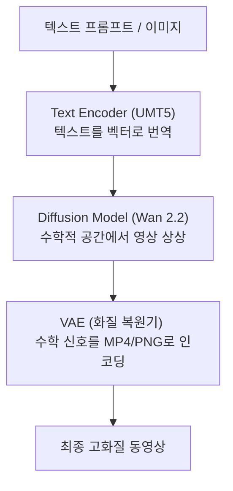

## 🎬 개요: "맥북 비행기 이륙 소리와 텅 빈 지갑의 탈출구"

AI 비디오 제작에 입문한 크리에이터가 마주하는 가장 큰 장벽은 **'맥북의 스로틀링(발열로 인한 버벅임)'**과 **'상용 비디오 API의 흉악한 비용'**입니다. 

1. **맥북 M3 Max의 비명**: 로컬에서 수십억 매개변수의 대형 비디오 모델을 돌리기 시작하면 48GB 메모리도 숨을 헐떡이며 팬이 비행기 이륙 소리를 냅니다. 키보드는 겨울철 손난로를 넘어 라디에이터가 되고 생성 시간은 하염없이 늘어납니다.
2. **Kling/Runway 등 상용 API의 비용 공세**: 1분 30초짜리 짧은 시네마틱 티저 하나를 완성하기 위해 시행착오를 거쳐 수백 장의 클립을 생성하다 보면 결제 크레딧 3만 원이 단 몇 시간 만에 증발합니다.

이러한 지옥 같은 상황에서 구세주로 떠오른 솔루션이 바로 **Vast.ai**와 오픈소스 **Wan 2.2 + ComfyUI**의 결합입니다. 개인용 고가 GPU 장비를 집안에 들여놓지 않고도, 전기세 수준의 저렴한 비용으로 상용 API급 고해상도 영상을 뽑아낼 수 있는 **'로컬 클라우드 셀프 호스팅 혁명'**의 실전 기록을 정리합니다.

---

## 💰 1. 요금 혁명 시뮬레이션: "한 시간에 500원짜리 RTX 4090"

Vast.ai는 전 세계의 유휴 GPU 연산 자원을 중개하는 도매 시장(Marketplace)입니다. AWS나 Google Cloud 같은 대기업 클라우드가 시간당 3,000~4,000원씩 받는 **RTX 4090(24GB VRAM) 서버**를 이곳에서는 **시간당 $0.29 ~ $0.36 (약 450원 ~ 550원)**에 빌릴 수 있습니다.

### 💳 실제 한 달 운영비 시뮬레이션 (20달러 충전 기준)
작업이 끝난 후 인스턴스를 삭제하지 않고 **정지(Stop)** 상태로 유지하여 모델 파일(약 60GB)을 보존하는 알뜰한 시나리오입니다.

* **동영상 제작 가동 (월 10시간)**: 10시간 × $0.36 = $3.60 (약 5,500원)
* **서버 오프라인 보존 (월 710시간)**: GPU 요금은 0원이며, 호스트의 SSD 용량 점유비(150GB 기준 시간당 약 $0.004)만 차감. 710시간 × $0.004 = $2.84 (약 4,300원)
* 💰 **월 총 지출**: **$6.44 (약 9,800원)** ➔ 커피 두 잔 값으로 나만의 전용 AI 비디오 렌더링 서버를 소유!

> [!WARNING]
> **24시간 방치 주의**: 서버 가동 상태(Running)로 종료하지 않고 방치하면 한 달 내내 요금이 발생해 약 38만 원($250)의 요금 폭탄을 맞을 수 있습니다. 작업이 끝나면 반드시 **[Stop]**을 누르는 버릇이 핵심입니다.

---

## 🧠 2. Wan 2.2의 모듈식 아키텍처와 ComfyUI 연동

ComfyUI는 대형 비디오 모델을 하나의 무거운 패키지로 로딩하지 않고, 역할별로 쪼갠 **조립식 모듈 구조**로 구동됩니다.



### 💡 왜 Wan 2.6이 아니라 2.2 인가?
알리바바의 **Wan 2.6**은 유료 클라우드 API 전용 비공개 모델(Closed-source)로 개발되어 로컬 서버용 원본 파일이 존재하지 않습니다. 반면 **Wan 2.2**는 개인용 로컬 GPU 환경에 올려 무제한으로 공짜 구동할 수 있는 오픈소스 최고 등급(State-of-the-Art) 모델입니다. 

* **Text-to-Video (T2V)**: 무에서 유를 창조할 때는 가볍고 빠른 **Wan 2.1 14B FP8** 버전을 채택.
* **Image-to-Video (I2V)**: 주연 배우 이미지 일관성(Starring Roles)을 적용할 때는 최신작인 **Wan 2.2 14B LOW/HIGH** 버전을 채택하여 하이브리드로 병합 구성합니다.

---

## 🛠️ 3. 백엔드 세팅 무인 자동화 (AG의 실전 일지)

가입 및 $20 결제를 마친 마스터님의 Vast.ai 인스턴스에 에이전트 AG가 원격으로 접속해 세팅을 마친 실전 일지입니다.

### ① 150GB 대용량 가상 디스크 구성
* Wan 2.2 및 2.1 모델 세트(총 약 50~60GB)와 영상 저장 공간을 고려해 컨테이너 디스크 크기를 **150GB**로 넉넉하게 지정했습니다.

### ② 맥북 ➔ 클라우드 업로드 생략 (초고속 Direct Download)
* 60GB에 달하는 대용량 파일들을 맥북에서 내려받아 해외 클라우드 서버로 다시 올리려면 반나절이 걸립니다.
* 대신 데이터센터 초고속 백본망(1Gbps)에 물려 있는 Vast.ai 서버 내부에서 **Hugging Face CLI** 명령어를 직접 실행해 **단 5분 만에 다운로드를 완료**했습니다.

```bash
# VAE, Text Encoder, Wan 2.1/2.2 모델들을 각 폴더에 다이렉트 배치
hf_hub_download(repo_id='Kijai/WanVideo_comfy', filename='Wan2_2_VAE_bf16.safetensors', local_dir='models/vae')
hf_hub_download(repo_id='Kijai/WanVideo_comfy', filename='umt5-xxl-enc-fp8_e4m3fn.safetensors', local_dir='models/text_encoders')
hf_hub_download(repo_id='Kijai/WanVideo_comfy', filename='Wan2_2-I2V-A14B-LOW_bf16.safetensors', local_dir='models/diffusion_models')
```

---

## 🚀 4. 한 줄 요약: "비디오 프로덕션의 민주화"

이로써 마스터님은 맥북의 수명을 단축시키는 발열 스트레스에서 완전히 해방되었으며, 한 달에 1만 원 내외의 커피 한 잔 값으로 힉스필드나 클링 상용 API를 능가하는 **'오픈소스 Wan 2.2 비디오 가속 인프라'**를 독점 소유하게 되었습니다. 이 실전 구축 스토리는 향후 출판될 마스터님의 에이전트 가이드북에서 **"비용 절감과 기술 실증을 동시에 잡은 퍼스널 AI 프로덕션 혁명"** 챕터의 핵심 소스로 사용될 예정입니다.
